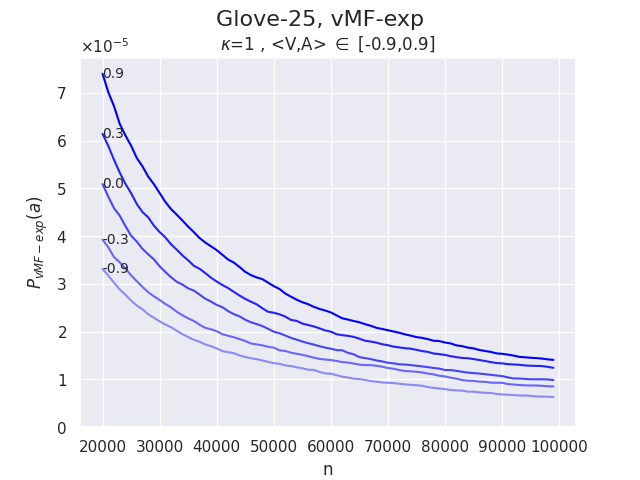

# von Mises-Fisher Sampling of GloVe Vectors

This anonymous repository contains Python code for reproducing the experiments described in the Tiny Paper titled _"von Mises-Fisher Sampling of Glove Vectors"_. This paper is currently under review for presentation at the [FPI@ICLR 2025](https://sites.google.com/view/fpiworkshop/about) workshop and will be made available online upon publication.

## Introduction

A recent publication introduced von Mises-Fisher exploration (vMF-exp), a scalable sampling method for exploring large action sets in reinforcement learning problems where hyperspherical embedding vectors represent these actions.
The authors demonstrated that vMF-exp scales to millions of actions
and exhibits several desirable properties. However, they did not test vMF-exp on publicly available
real-world data, which is essential for reproducibility and deeper understanding of the method.


We address this limitation by experimentally validating the main properties of vMF-exp on
a large-scale, publicly available real-world dataset of GloVe word embedding vectors. The purpose of our submission to FPI @ ICLR 2025 is twofold: (1) to present vMF-exp
to the scientific community interested in sampling methods during the workshop; and (2) to provide a
fresh perspective on the initial work, with reinforced validation. 

## Download data

The GloVe word embedding dataset used in our experiments is publicly available for
download at: [https://nlp.stanford.edu/projects/glove/](https://nlp.stanford.edu/projects/glove/)

Experiences were run using the 25-dimensional embedding vectors (GloVe-25).

After downloading the correct file, unzip it and place it in a folder named `dataset`.

## Compute probabilities for a given set of parameters

The script `compute_probas.py` will run Monte Carlo simulations estimating the probability for von Mises-Fisher exploration and Boltzmann exploration to sample an action with known similarity given a state vector.

All vectors are sampled from the GloVe-25 dataset previously downloaded. The result can then be plotted using `plot_probas.py`.

For instance, to reproduce **Figure 2.a**, one can run the following command:

```
python -m src.compute_probas -k 1 -a 0.0 -n glove.25 -bs 3000 -nt 10000
```
which will run the corresponding Monte Carlo Simulations, followed by the command:
```
python -m src.plot_probas --path results/glove.25/k\=1.0_a\=0.00_samples\=30000000/
```
which will create a plot similar to the following one:


and saved in a sub-folder of `/results/` named according to the chosen parameters.


## Compare Boltzmann and von-Mises Fisher Explorations for a range of values

The script `compare_boltzmann_vs_vmf.py` will reproduce **Figure 1.a** and **Figure 1.b** for a specified range of values of <V,A> that must first be computed using `compute_probas.py` with changing values of a (see above).

For instance, running `compute_probas.py`  several times with values of a in [0.9,0.3,0.0,-0.3,-0.9] and then running:

```
python -m src.compare_boltzmann_vs_vmf --values 0.9,0.3,0.0,-0.3,-0.9
```

will create the following two plots:



