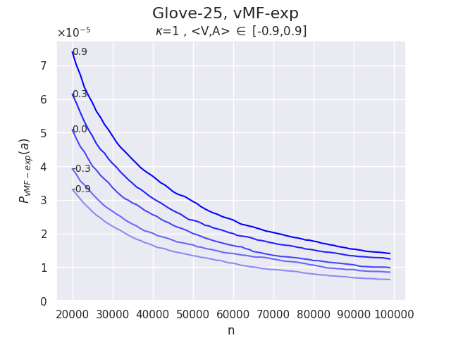

# von Mises-Fisher Exploration
Repository for the Paper "von Mises-Fisher Sampling of Glove Vectors" by Anonymous Authors.

A recent publication introduced von Mises-Fisher exploration (vMF-exp), a scalable sampling method for exploring large action sets in reinforcement learning problems where hyperspherical embedding vectors represent these actions. We present the first experimental validation of vMF-exp’s key theoretical and scalability properties on a publicly available real-world dataset, confirming the potential of~this~method.

## Download data

Data can be found at https://nlp.stanford.edu/projects/glove/
Experiences were run using the 25 dimensions embeddings provided.
After the correct file is downloaded, Unzip it and place it into the empty folder "dataset" already created.

## Compute probabilities for a given set of parameters
The script `compute_probas.py` will run Monte Carlo simulations estimating the probability for von Mises-Fisher exploration and Boltzmann exploration to sample an action with known similarity given a state vector. All vectors are sampled from the Glove 25 dataset previously downloaded (see above). The result can then be plotted using `plot_probas.py`.

For instance, to reproduce **Figure 2.a**, one can run the following command
```
ppython -m src.compute_probas -k 1 -a 0.0 -n glove.25 -bs 3000 -nt 10000
```
which will run the corresponding Monte Carlo Simulations, followed by the command
```
python -m src.plot_probas --path results/glove.25/k\=1.0_a\=0.00_samples\=30000000/
```
which will create a plot similar to the following one


and save in a sub-folder of /results/ named according to the chosen parameters.


## Compare Boltmann and von-Mises Fisher Explorations for a range of values
The script `compare_boltzmann_vs_vmf.py` will reproduce **Figure 1.a** and **Figure 1.b** for a specified range of values of <V,A> that must first be computed using `compute_probas.py` with changing values of a (see above).

For instance, running `compute_probas.py`  several times with values of a in [0.9,0.3,0.0,-0.3,-0.9] and then running
```
python -m src.compare_boltzmann_vs_vmf --values 0.9,0.3,0.0,-0.3,-0.9
```
will create the following two plots


